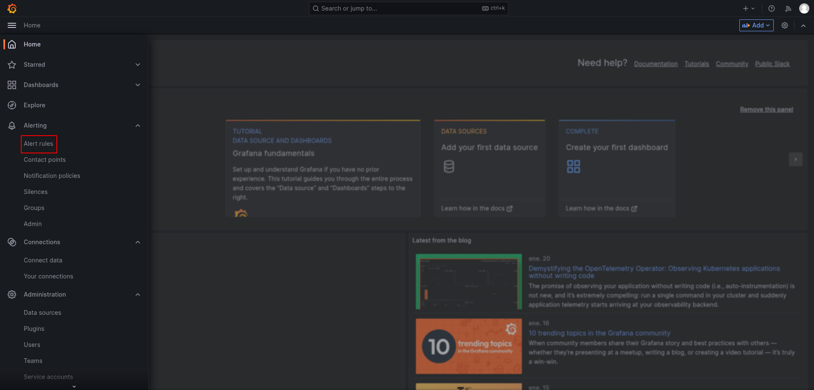
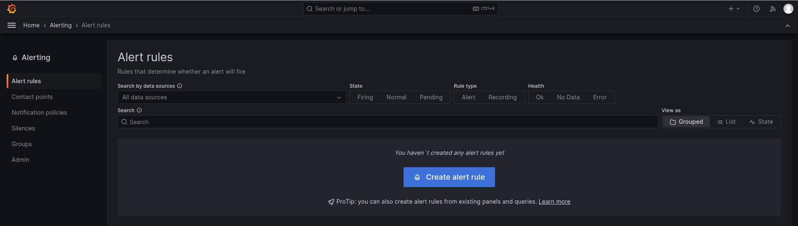
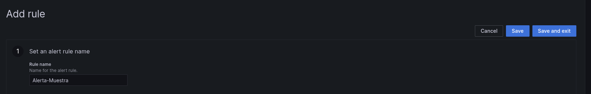
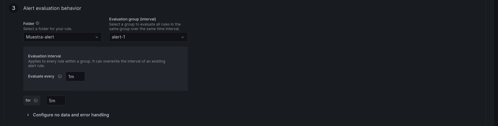
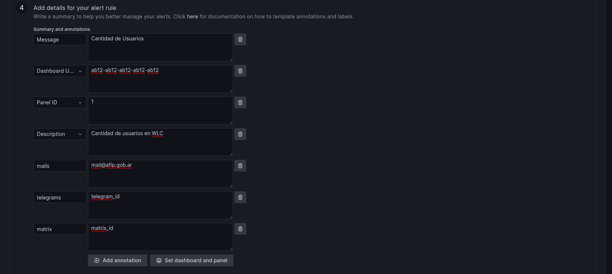

# Bot

Antes de levantar los servicios, es necesario crear la red compartida entre ambos

```bash
 docker network create bot-net
```
Levantamos Redis insight (opcional)

```bash
docker-compose -f docker-compose.insight.yml up -d

```

```bash
docker-compose up
```


# Skills: Como usar

## Grafana
Para poder utilizar el skill de grafana: 
1. Debera ingresar a la seccion "Alerting" -> "Alert rules".

2. Luego seleccionar "Create alert rule". 

3. Rellenar el campo "Rule Name".

4. Crear query que generara las alertas.
5. Ingresar la condicion de la alerta y cada cuanto tiempo se enviara.

6. Ingresar las condiciones de la alerta que se muestran a continuacion:
Debera ingresar todos los campos. En caso de que no lo haga se generara un error.  Para los destinatarios como mails, telegrams y matrix, si no se rellenan no se enviaran a ningun destinatario. En caso de que haya mas de 1 destinatario, separar por ",". Ej: mail1@afip.gob.ar, mail2@afip.gob.ar

7. Luego seleccionar el boton "Save" o "Save and exit" en la pagina arriba a la derecha. 

#### enviar mensaje
Formato para enviar un mensaje via mail, matrix y/o telegram. 
Obligatorio rellenar el campo "Message" y asignar al menos 1 destinatario. 
{url}/skill/grafana/enviar_msg

Ejemplo de curl:
```bash
curl --location 'http://bot:8080/skill/grafana/enviar_msg' \
--header 'Content-Type: application/json' \
--header 'Authorization: Bearer token' \
--data-raw '{
"alerts": 
    [
        {
            "annotations": {
                "Message": "Mensaje a enviar",
                "description": "Descripcion del mensaje a enviar.", 
                "mails": "mail@afip.gob.ar", 
                "matrix": "matrix_id", 
                "telegrams": "telegram_id"
            }, 
        }
    ]
}'
```

#### enviar imagen
Formato para enviar una imagen via mail, matrix y/o telegram. 
Obligatorio rellenar el campo "image_url" y asignar al menos 1 destinatario. 
Si no quiere enviar texto junto a la imagen, no complete el campo.
{url}/skill/grafana/enviar_imagen

Ejemplo de curl:
```bash
curl --location 'http://bot:8080/skill/grafana/enviar_imagen' \
--header 'Content-Type: application/json' \
--header 'Authorization: Bearer token' \
--data-raw '{
"alerts": 
    [
        { 
            "annotations": {
                "Message": "Mensaje a enviar",
                "description": "Descripcion del mensaje a enviar.", 
                "image_url": "url",
                "mails": "mail@afip.gob.ar", 
                "matrix": "matrix_id", 
                "telegrams": "telegram_id"
            }, 
        }
    ],
"image_url":"image_url"
}'
```

<!--
#### enviar archivo
Si quiere enviar un archivo, debera agregar un campo en el punto 6 como: "archivo" y en el contenido del campo insertar el archivo en base 64.
{url}/skill/grafana/enviar_archivo

Ejemplo de curl: 
```bash
curl --location 'http://bot:8080/skill/grafana/enviar_archivo' \
--header 'Content-Type: application/json' \
--header 'Authorization: Bearer token' \
--data-raw '{
"alerts": 
    [
        {"status": "firing", 
        "labels": {"alertname": "TestAlert", "instance": "Grafana"}, 
        "annotations": {
            "Message": "Cantidad de Usuarios", 
            "description": "Cantidad de usuarios en WLC", 
            "mails": "mail@afip.gob.ar", 
            "matrix": "matrix_id", 
            "telegrams": "telegram_id"}, 
            "dashboardURL": "http://localhost:3000/d/abcdefghi", 
            "panelURL": "http://localhost:3000/d/abcdefghi?viewPanel=1"
        }
    ],
"archivo":"archivo_en_base64"
}'
```
-->

## Webhook

### Destinatarios

#### Matrix
!codigo:matrix-homo.afip.gob.ar

El bot ya debe estar en la sala. El bot se llama "botdiincm".

#### Mail
usuario@afip.gob.ar o usuario.

Puede estar con o sin "@afip.gob.ar".

#### Telegram
codigo

Ejemplo: 123456789

El bot ya debe estar en la sala. El bot se llama "Comu_opsdroid_homo" o "Comu_opsdroid". FUnciona con ambos.

### Authorization
Bearer token "token"

### Envio de mensaje/mail

#### enviar mensaje
{url}/skill/webhook/enviarmsg
Crear un body que sea un json con formato:
- {"connector":"", "target":"", "text":""} 
- connector: Ingresar el conector que se va a utilizar: mail / telegram / matrix
- target: Ingresar destinatario. En el caso de mail, el mismo puede tener @afip.gob.ar como no tenerlo.
- text: Ingresar mensaje a enviar. No puede ser vacio.
- Ejemplo: {"connector":"mail", "target":"usuario@afip.gob.ar", "text":"Mensaje a enviar."}

curl --location 'http://127.0.0.1:8080/skill/webhook/enviarmsg' --header 'Content-Type: application/json' --header 'Authorization: Bearer ey...' --data-raw '{"connector":"mail", "target":"usuario@afip.gob.ar", "text":"testeo"}'


#### Ejemplo en bash

```bash
#!/bin/bash
# ./enviar_mensaje.sh

# Cargar variables desde .env
if [[ -f .env ]]; then
  export $(grep -v '^#' .env | xargs)
else
  echo "Error: No se encontró el archivo .env"
  exit 1
fi

# Verificar si las variables están definidas
if [[ -z "$BEARER_TOKEN" || -z "$API_URL" ]]; then
  echo "Error: BEARER_TOKEN, API_URL no están definidos en el .env"
  exit 1
fi

# Construir la URL completa
URL="$API_URL/skill/webhook/enviarmsg"
PROXY=""

# Función de ayuda
function show_help() {
  echo "Uso: $0 <connector> <target> <mensaje>"
  echo
  echo "Parámetros:"
  echo "  connector   → Nombre del conector (ej. matrix)"
  echo "  target      → Destino del mensaje (ej. '!id_de_sala:matrix-homo.afip.gob.ar')"
  echo "  mensaje     → Contenido del mensaje a enviar"
  echo
  echo "Ejemplo:"
  echo "  $0 matrix '!codigo_de_sala:matrix-homo.afip.gob.ar' 'Hola desde Bash'"
  echo
  echo "Variables de entorno (definidas en .env):"
  echo "  BEARER_TOKEN  → Token de autenticación"
  echo "  API_URL       → URL base del servidor"
  exit 0
}

# Mostrar ayuda si se usa -h o --help
if [[ "$1" == "-h" || "$1" == "--help" ]]; then
  show_help
fi

# Parámetros requeridos
CONNECTOR="$1"
TARGET="$2"
TEXT="$3"

# Verificar que se pasaron todos los parámetros
if [[ -z "$CONNECTOR" || -z "$TARGET" || -z "$TEXT" ]]; then
  echo "Error: Faltan parámetros."
  show_help
fi

DATA=$(jq -n \
  --arg connector "$CONNECTOR" \
  --arg target "$TARGET" \
  --arg text "$TEXT" \
  '{connector: $connector, target: $target, text: $text}')


curl --location "$URL" \
     --proxy "$PROXY" \
     --header "Content-Type: application/json" \
     --header "Authorization: Bearer $BEARER_TOKEN" \
     --data-raw "$DATA"
```

```bash
# .env
BEARER_TOKEN="...bearer_token..."
API_URL="http://10.30.154.110:8080"
```


#### enviar imagen
{url}/skill/webhook/enviarimagen
Crear un body que sea un json con formato:
- {"connector":"", "target":"", "text":"", "tipo": "", "nombre": "", "image":""} 
- connector: Ingresar el conector que se va a utilizar: mail / telegram / matrix
- target: Ingresar destinatario. En el caso de mail, el mismo puede tener @afip.gob.ar como no tenerlo.
- text: Ingresar mensaje a enviar. En caso de que no se quiera enviar mensaje puede dejarlo vacio.
- tipo: El tipo del archivo: png / jpg.
- nombre: nombre que se utilizara para la imagen.
- image: Insertar la imagen en base 64.  
- Ejemplo: {"connector":"mail", "target":"usuario@afip.gob.ar", "text":"Mensaje a enviar.", "tipo":"image/jpg", "nombre": "logo-afip.png", "image": "imagenEnBase64" }

curl --location 'http://127.0.0.1:8080/skill/webhook/enviarimagen' --header 'Content-Type: application/json' --header 'Authorization: Bearer ey...' --data-raw '{"connector":"mail", "target":"usuario@afip.gob.ar", "text":"Mensaje a enviar.", "tipo":"image/jpg", "nombre": "logo-afip.png", "image": "imagenEnBase64" }'

#### enviar archivo
{url}/skill/webhook/enviararchivo
Crear un body que sea un json con formato:
- {"connector":"", "target":"", "text":"", "tipo": "", "nombre": "", "archivo":""} 
- connector: Ingresar el conector que se va a utilizar: mail / telegram / matrix
- target: Ingresar destinatario. En el caso de mail, el mismo puede tener @afip.gob.ar como no tenerlo.
- text: Ingresar mensaje a enviar. En caso de que no se quiera enviar mensaje puede dejarlo vacio.
- tipo: El tipo del archivo: pdf.
- nombre: nombre que se utilizara para el archivo.
- archivo: Insertar el archivo de tipo pdf a base64
- Ejemplo: {"connector":"mail", "target":"usuario@afip.gob.ar", "text":"Mensaje a enviar.", "tipo":"application/pdf", "nombre": "archivo-afip.pdf", "archivo": "archivoEnBase64" }

curl --location 'http://127.0.0.1:8080/skill/webhook/enviararchivo' --header 'Content-Type: application/json' --header 'Authorization: Bearer ey...' --data-raw '{"connector":"mail", "target":"usuario@afip.gob.ar", "text":"Mensaje a enviar.", "tipo":"application/pdf", "nombre": "archivo-afip.pdf", "archivo": "archivoEnBase64" }'


